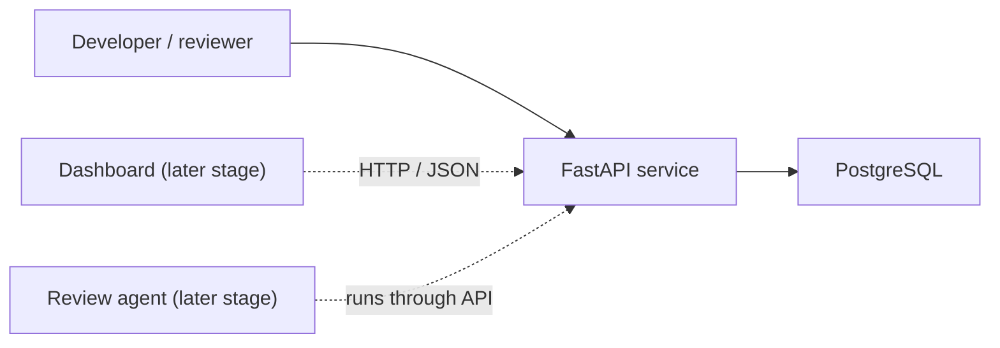

# AgentOps Control Tower

An AI agent operations platform prototype. Its first demo workflow reviews fictional procurement contract clauses against fictional policy. The current version includes the backend foundation, seven labeled cases, and a deterministic, evidence-linked review baseline, plus optional Gateway-backed AI review and a local upload dashboard.

## Stage 2: technical foundation

### Architecture



- **FastAPI** exposes HTTP endpoints and generates an OpenAPI page at `/docs`.
- **PostgreSQL** is the planned store for agent runs, traces, evaluations, and review decisions.
- **Docker Compose** starts the API and database together for local development.
- **Model provider and dashboard are deferred.** Later stages can add them behind clear interfaces without putting provider-specific code in this foundation.

### Services and checks

| Endpoint / service | Purpose |
|---|---|
| `GET /` | Shows that the API service is present |
| `GET /healthz` | Liveness check: tells whether the API process responds |
| `GET /readyz` | Readiness check: verifies that PostgreSQL accepts a connection |
| PostgreSQL health check | Lets Compose wait for the database before starting the API |

Liveness and readiness are separate because the API process can be alive while its database is unavailable.

## Run locally on macOS

**Prerequisite:** Docker Desktop with Docker Compose. The credentials in `.env.example` are for local development only.

1. Open Terminal and go to this project folder.
2. Copy `.env.example` to `.env`:

   ```bash
   cp .env.example .env
   ```

3. Build and start both services:

   ```bash
   docker compose up --build
   ```

4. In a browser, open the host port set in .env. For this project, use port 8200:
   - API overview: http://localhost:8200/
   - Interactive API docs: http://localhost:8200/docs
   - Liveness check: http://localhost:8200/healthz
   - Database readiness check: http://localhost:8200/readyz

Stop the services with `Ctrl+C`. Run `docker compose down` to remove the containers while keeping the database volume. Run `docker compose down --volumes` only when you intentionally want to erase the local database data.

## Run tests without Docker

Requires Python 3.12 or later. From the project folder:

```bash
python3 -m venv .venv
source .venv/bin/activate
python -m pip install -e ".[dev]"
pytest
```

The endpoint tests mock the database check, so they do not require PostgreSQL. The live `/readyz` check does require PostgreSQL.

## Configuration

Copy `.env.example` to `.env` for local Compose runs. Do not commit a real `.env` file or put production credentials in source control. The API reads its database connection from `DATABASE_URL`.

## Current scope

This is a local prototype. It does not yet implement user accounts, persistent review history, audit-ready document retention, or production deployment. Uploaded documents are processed in memory and are not stored by this service.

## Stage 3: fictional evaluation data

The `data/` folder contains fictional procurement policies and seven labeled contract scenarios. The labels are expected prototype behaviors, not legal advice or evidence of real-world accuracy. Validate the files with Python's standard library:

```bash
python3 scripts/check_demo_data.py
python3 -m unittest discover -s tests -p 'test_stage3_data.py' -v
```

See [`docs/stage3-test-design.md`](docs/stage3-test-design.md) for the scenario matrix, evidence rules, and test limitations.

## Stage 4: policy review baseline

The review engine applies structured policy controls to the supplied fictional contract clauses. It returns approve / negotiate / escalate, with references and exact text for every finding. It does not read the expected labels and it does not call an LLM.

The data checks and review-engine tests use the Python standard library:

    python3 scripts/check_demo_data.py
    python3 -m unittest discover -s tests -p 'test_stage*.py' -v

With the Docker services running, open http://localhost:8200/docs. Use GET /demo/cases to list the fictional case IDs and POST /reviews with the JSON body {"case_id":"C03"} to run a review. The API response includes the recommendation, escalation flag, and the exact contract and policy text behind each finding.

This is a rules-based baseline over already-supplied clauses. It does not yet extract clauses from uploaded documents or make legal judgments. A later model integration can be compared against this baseline; human approval remains required.

## Stage 5: offline baseline evaluation

Run `python3 scripts/evaluate_baseline.py` from the project root to compare the reviewer with the seven fictional expected labels. The report includes disposition accuracy, escalation precision and recall, finding-type precision/recall/F1, evidence-status precision/recall/F1, source-text citation validity, and the human-review gate. Evaluation removes expected labels before calling the reviewer. The seven-case score is a prototype check, not evidence of production accuracy. See [`docs/stage5-baseline-evaluation.md`](docs/stage5-baseline-evaluation.md).

## Stage 6: optional AI-assisted review

`POST /reviews/ai` sends one fictional case through the separately running RelayGuard / Gateway LLM. AgentOps labels the work `complex`; the Gateway selects the configured GPT and backup and returns routing/usage metadata. Each finding includes an `evidence_status`: `confirmed_conflict`, `missing_from_supplied_text`, or `requirement_not_established`. AgentOps checks every cited ID against the supplied contract and policy and attaches source text itself. Invalid citations or evidence statuses fail the request. Every result still requires a human final decision.

## Stage 7: evidence clarity and upload dashboard

Open http://localhost:8200/dashboard (or the host port configured in `.env`) for the local review screen. Upload a contract plus optional company policy documents in PDF, DOCX, or UTF-8 TXT format, up to 10 MB each. PDFs must contain selectable text; OCR is not included. Without uploaded policies, the demo uses its bundled fictional policies. Custom policy uploads require AI-assisted mode; the local deterministic baseline only understands the bundled machine-readable rules. Text is sectioned with simple heuristics, shown back in the dashboard for verification, and not persisted by this service.

Choose **Rules baseline** to run locally without a model call. Choose **AI-assisted** to send extracted contract text to the configured RelayGuard Gateway; model cost may apply. The dashboard shows the recommendation, each evidence category, exact contract/policy quotations, extracted sections, model and fallback metadata, and estimated usage when returned. Do not upload confidential customer contracts unless you have approval to send them to the configured model provider.

The supplied cases are all fictional. C07 is a mixed-evidence-status evaluation case. The offline report measures the deterministic reviewer against seven fictional labels; it is not an AI model benchmark and is not evidence of production/legal accuracy. Actual real-world validation requires appropriately approved, redacted contracts, the applicable policies, and human-reviewed labels.

See [`docs/stage7-evidence-dashboard.md`](docs/stage7-evidence-dashboard.md) for category definitions, data flow, API use, evaluation limits, and test instructions.

## Technical references

- [FastAPI — First Steps](https://fastapi.tiangolo.com/tutorial/first-steps/)
- [Docker Compose — What is Compose?](https://docs.docker.com/compose/intro/)
- [PostgreSQL Official Image](https://hub.docker.com/_/postgres)
- See [`docs/architecture-stage2.md`](docs/architecture-stage2.md) for why we chose each component and what each API endpoint does.
